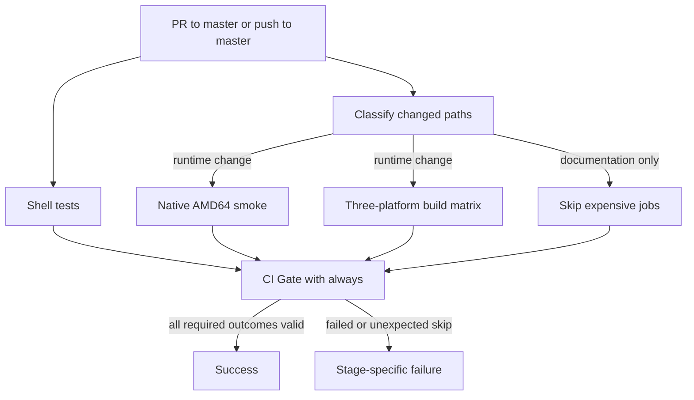

# Pull Request CI Gates - Plan

## Goal Capsule

- **Objective:** Contributors and maintainers receive a dependable signal before merge that shell behavior, the runnable image, and every published CPU architecture remain valid without exposing publication credentials.
- **Means:** Add layered, read-only validation with one workflow-owned summary gate while keeping image publication in the existing release workflow (KTD1-KTD5).
- **Product authority:** This plan owns pull request validation, merge-gate behavior, and its repository-settings handoff. Release publication remains governed by the existing release workflow.
- **Open blockers:** None.

---

## Product Contract

### Summary

Add a required pull request CI gate that combines shell tests, a native AMD64 container smoke test, and build validation for every published architecture. Keep the gate safe for fork contributions and keep registry publication separate.

### Problem Frame

The repository currently validates and publishes images only after a release is published. Pull requests can therefore reach merge without an automated signal for shell regressions, container startup, Dashboard availability, or architecture-specific build failures.

Manual validation caught a latent test defect: `tests/test_reload.sh` prints an unbound `MODE` error but still exits successfully because the status is masked. A green CI result must mean the tested behavior completed, not merely that the outer script returned zero.

### Actors

- A1. **Contributor:** Opens or updates a pull request and needs actionable validation without access to repository secrets.
- A2. **Maintainer:** Reviews the required result, configures the merge gate, and decides whether a change may merge.
- A3. **GitHub Actions:** Executes isolated validation and reports a stable result for the latest pull request revision.
- A4. **Release publisher:** Uses the existing release-only workflow and Docker Hub credentials after changes have passed the merge gate.

### Key Decisions

- **Layered validation** (session-settled: user-directed — chosen over shell-only checks and emulated runtime tests on every architecture: it balances defect coverage with reliable execution). Governs R6, R7, R8.
- **Read-only pull request execution** (session-settled: user-directed — chosen over sharing the credentialed publication path: fork code must not receive registry credentials or write authority). Governs R5, R10.
- **Stable required result with selective expensive work** (session-settled: user-directed — chosen over running every job for every file and skipping the entire required workflow by path: it controls cost without leaving required checks pending). Governs R1, R2, R3, R4.
- **Repair the false-green test baseline** (session-settled: user-directed — chosen over excluding the hot-reload test or accepting advisory failures: a successful test must represent completed behavior). Governs R6.
- **Defer supply-chain integrity expansion** (session-settled: user-directed — chosen over adding checksum and action-pinning work to this CI change: the current goal is pre-merge regression detection). Governs the Scope Boundaries.

### Requirements

**Invocation and merge-gate contract**

- R1. Every pull request targeting `master` and every push to `master` must produce one stable CI gate result for the evaluated revision.
- R2. Changes limited to documentation or other non-runtime content may skip expensive validation jobs, but the stable gate from R1 must still reach a successful terminal conclusion.
- R3. A newer revision of the same pull request must cancel superseded validation work so contributors receive results for the latest code.
- R4. The stable gate must be configured as a required check for `master`, and repository setup instructions must identify the maintainer-owned setting needed to enforce it.
- R5. Pull request validation must run with read-only repository permissions and without Docker Hub credentials, production configuration, or image publication rights.

**Behavior validation**

- R6. CI must run both repository shell test suites and fail when an unbound variable, aborted code path, or masked command error prevents the intended assertions from completing.
- R7. CI must build and start the AMD64 image with a non-sensitive fixture, then verify container health, the Mihomo version API, Dashboard availability, and preservation of a caller-provided safe path alongside the bundled UI path.
- R8. CI must validate image builds for `linux/amd64`, `linux/arm64`, and `linux/arm/v7` without publishing those pull request artifacts.
- R9. A failed check must identify whether the failure came from shell behavior, AMD64 runtime smoke validation, or a specific architecture build.

**Release compatibility**

- R10. The existing published-release workflow must remain the only path that logs into Docker Hub and pushes the three-platform image manifest.

### Key Flows

- F1. Runtime-affecting pull request
  - **Trigger:** A contributor opens or updates a pull request that changes runtime, build, test, configuration, or CI behavior.
  - **Actors:** A1, A2, A3
  - **Steps:** GitHub Actions evaluates the latest revision, runs shell validation, performs the AMD64 smoke test, validates all three builds, and reports the stable gate.
  - **Outcome:** The pull request can merge only after the required gate succeeds.
  - **Covered by:** R1, R3, R4, R6, R7, R8, R9.
- F2. Documentation-only pull request
  - **Trigger:** A contributor changes only content classified as non-runtime.
  - **Actors:** A1, A2, A3
  - **Steps:** GitHub Actions reports the stable gate while omitting expensive jobs that cannot affect the image.
  - **Outcome:** The pull request receives a terminal result instead of waiting indefinitely for a skipped required workflow.
  - **Covered by:** R1, R2, R4.
- F3. Published release
  - **Trigger:** A maintainer publishes a release after validated changes have merged.
  - **Actors:** A2, A4
  - **Steps:** The existing release workflow authenticates to Docker Hub, builds the three target platforms, and publishes the manifest.
  - **Outcome:** Publication behavior remains isolated from untrusted pull request execution.
  - **Covered by:** R5, R8, R10.

### Acceptance Examples

- AE1. Runtime change passes all layers
  - **Covers R1, R4, R6, R7, R8.**
  - **Given:** A pull request changes `start.sh` or the image build.
  - **When:** Validation runs on its latest revision.
  - **Then:** Both shell suites, the AMD64 smoke test, and all three architecture builds complete before the stable gate succeeds.
- AE2. Documentation-only change does not block forever
  - **Covers R1, R2, R4.**
  - **Given:** A pull request changes only documentation.
  - **When:** Expensive validation is unnecessary.
  - **Then:** The stable required result still completes successfully.
- AE3. Fork contribution receives no publication authority
  - **Covers R5, R10.**
  - **Given:** A pull request originates from a fork.
  - **When:** Its validation executes contributor-controlled code.
  - **Then:** The workflow can validate the change without Docker Hub secrets, write permissions, or a push step.
- AE4. Masked shell error becomes a real failure
  - **Covers R6, R9.**
  - **Given:** A shell test reaches an unbound variable or aborts before its assertions finish.
  - **When:** CI runs that suite.
  - **Then:** The suite exits non-zero and the gate identifies shell validation as the failing layer.
- AE5. Release publication remains separate
  - **Covers R8, R10.**
  - **Given:** A maintainer publishes a release.
  - **When:** The existing publication workflow runs.
  - **Then:** Docker Hub receives the AMD64, ARM64, and ARMv7 manifest without granting those credentials to pull request validation.

### Scope Boundaries

- Do not publish pull request images or add preview-image lifecycle management.
- Do not run ARM64 or ARMv7 containers under QEMU as a required runtime check; those platforms receive build validation only.
- Do not add production subscriptions, remote production configuration, or outbound proxy validation to CI.
- Defer upstream artifact checksum verification, immutable GitHub Action pinning, SBOM generation, provenance attestations, and vulnerability policy to separate supply-chain work.
- README architecture wording may be reconciled during implementation, but it is not part of the CI gate acceptance contract.
- Do not redesign release tagging or Docker Hub publication behavior beyond preserving compatibility with R10.

### Dependencies / Assumptions

- GitHub Actions remains enabled for the repository and can run Docker Buildx with QEMU build support.
- Maintainers have authority to configure the required check for `master`; the repository currently has no ruleset that supplies this gate automatically.
- Image builds depend on the availability and integrity of the upstream release assets already consumed by the Dockerfile.
- Fork workflows may require maintainer approval under GitHub policy, but approval must not grant them repository secrets or write permissions.

### Sources / Research

The Product Contract above is preserved from the `ce-brainstorm` artifact. Its R/F/AE IDs and product meaning are unchanged by this implementation deepening.

- `.github/workflows/docker-build.yml`: current release-only trigger, Docker Hub login, three-platform build, and publication behavior.
- `Dockerfile`: current target-architecture mapping and runtime image contract.
- `tests/test_mode.sh` and `tests/test_reload.sh`: current shell test coverage and the false-green hot-reload path.
- `docker-compose.yml`: current container health endpoint and exposed runtime surface.
- [GitHub required-check troubleshooting](https://docs.github.com/en/pull-requests/how-tos/merge-and-close-pull-requests/troubleshooting-required-status-checks): skipped required workflows can remain pending, while conditionally skipped jobs report a successful conclusion.
- [GitHub runner security](https://docs.github.com/en/actions/concepts/security/compromised-runners): fork pull request workflows receive read-only permissions and no secrets by default.
- [Docker multi-platform CI](https://docs.docker.com/build/ci/github-actions/multi-platform/): Buildx and QEMU support multi-platform validation, while loading multi-platform results for local runtime testing needs additional handling.

---

## Planning Contract

### Key Technical Decisions

- KTD1. **Use one non-skippable summary job as the required check** (session-settled: user-directed — chosen over requiring conditionally skipped worker jobs: documentation-only changes must still receive a terminal result). The `CI Gate` job uses `always()` and evaluates every upstream job result against the runtime-change classification. Implements R1-R4 and R9.
- KTD2. **Classify documentation-only changes inside the workflow.** A read-only change-detection job treats Markdown and `docs/**` changes as non-runtime and all other changes conservatively as runtime-affecting. The workflow itself always triggers, so path filtering cannot leave the required check pending. Implements R1-R3.
- KTD3. **Separate native runtime proof from portable build proof** (session-settled: user-directed — chosen over emulated runtime tests for every architecture: native AMD64 covers behavior while the matrix covers published build targets). The AMD64 job loads one local image and runs the smoke harness; the matrix builds three platforms with no output push. Implements R7-R9.
- KTD4. **Repair the shell baseline before trusting CI** (session-settled: user-directed — chosen over excluding the false-green suite: CI must fail on incomplete behavior). Initialize optional sourced variables safely, restore the hot-reload transaction contract already expressed by `tests/test_reload.sh`, and preserve the inner command status before releasing the lock. Implements R6 and AE4.
- KTD5. **Keep PR validation read-only and publication-free** (session-settled: user-directed — chosen over reusing the credentialed release workflow: fork-controlled code must not gain publication authority). Set explicit read-only token permissions, disable checkout credential persistence, omit login and push steps, and leave `.github/workflows/docker-build.yml` as the only publisher. Implements R5 and R10.

### High-Level Technical Design

The workflow separates classification, behavior validation, build portability, and policy aggregation. `CI Gate` is the only branch-protection contract. Worker job names remain diagnostic rather than policy-stable.

### Assumptions

- `master` remains the default integration branch for this repository.
- Current official major action lines are acceptable for this CI change; immutable action pinning remains deferred by the Product Contract.
- A change outside Markdown and `docs/**` is treated as runtime-affecting when its impact is uncertain.
- GitHub-hosted `ubuntu-latest` provides a native AMD64 Docker engine for the runtime smoke job.

### Risks & Dependencies

- Builds download Mihomo, MetaCubeXD, and geodata from upstream release endpoints. A remote outage can fail CI even when repository code is unchanged; job names and BuildKit logs must make that cause visible.
- ARM64 and ARMv7 build validation depends on Buildx/QEMU support. Runtime execution remains AMD64-only per scope.
- The existing merge commit regressed the hot-reload implementation while its test returned success after an unset-variable abort. U1 must restore the behavior represented by the complete test suite, not only silence the unset variable.
- GitHub branch protection is repository state, not a versioned file. U4 documents the exact required check and protects workflow changes with code-owner review. The shipping tail must configure both controls when credentials permit or report the maintainer handoff explicitly.

---

## Implementation Units

### U1. Restore a trustworthy shell-test baseline

- **Goal:** Make both existing shell suites execute all assertions and return the real behavior status.
- **Requirements:** R6, R9; F1; AE1, AE4.
- **Dependencies:** None.
- **Files:** `start.sh`, `tests/test_reload.sh`, `tests/test_mode.sh`.
- **Approach:**
  1. Give optional environment inputs safe empty defaults when `start.sh` is sourced or run under strict mode.
  2. Restore the subscription hot-reload transaction already specified by the reload suite, including controller validation, configuration backup, rollback, and no kernel restart.
  3. Capture `perform_subscription_update` success or failure without allowing a `local` declaration or lock cleanup to overwrite it.
  4. Add an explicit completion sentinel or equivalent assertion so an early abort cannot be reported as a passing suite.
- **Execution note:** Begin with the false-green regression and require the previously unreachable assertions to run before changing workflow files.
- **Patterns to follow:** Existing standalone Bash tests use `set -euo pipefail`, sourced functions, temporary fixtures, and command stubs.
- **Test scenarios:**
  - Covers AE4. Source `start.sh` without defining `MODE`, run a successful subscription update, and verify every hot-reload assertion completes.
  - Force the download, hook, controller, configuration-write, reload, and lock paths to fail independently; each call must return non-zero and preserve the prior configuration where applicable.
  - Run the mode suite with valid, invalid, empty, quoted, BOM, and write-failure fixtures; every existing assertion must continue to pass.
- **Verification:** Both scripts exit zero with their final success messages and no unbound-variable diagnostics. Injected failures return non-zero instead of being masked.

### U2. Add a reusable native AMD64 container smoke harness

- **Goal:** Prove that a built AMD64 image starts with a non-sensitive configuration and exposes its health, API, Dashboard, and composed safe paths.
- **Requirements:** R5, R7, R9; F1; AE1, AE3.
- **Dependencies:** U1.
- **Files:** `tests/fixtures/smoke-config.yaml`, `tests/test_container.sh`.
- **Approach:**
  1. Add a minimal local fixture with no subscription URL, real proxy credentials, or external traffic dependency.
  2. Accept an already-built image tag, start an isolated container, and install cleanup and diagnostic traps.
  3. Wait for Docker health with a finite timeout, then query `/version` and `/ui/` from inside the container.
  4. Inspect the Mihomo process environment and verify the caller value plus `/app/ui` are both present in `SAFE_PATHS`.
- **Execution note:** This unit is packaging-heavy; use the real image and process as the primary proof rather than mocks.
- **Patterns to follow:** The Dockerfile healthcheck and `start_mihomo` define the authoritative API endpoint, UI directory, PID file, and safe-path composition.
- **Test scenarios:**
  - Covers AE1. Run the image with the fixture and a caller safe path; health becomes healthy, `/version` returns Mihomo metadata, and `/ui/` returns successfully.
  - Start with a unique caller safe path and verify the running Mihomo environment contains it and `/app/ui` exactly as separate path entries.
  - Force a startup or readiness failure and verify the harness exits non-zero after printing container status and logs, then removes the container.
- **Verification:** The harness is repeatable on a native AMD64 Docker host and leaves no named container behind after success or failure.

### U3. Add layered read-only GitHub Actions validation

- **Goal:** Produce one stable `CI Gate` result while retaining stage-specific shell, runtime, and platform diagnostics.
- **Requirements:** R1-R3, R5-R10; F1-F3; AE1-AE5.
- **Dependencies:** U1, U2.
- **Files:** `.github/workflows/ci.yml`.
- **Approach:**
  1. Trigger on pull requests targeting `master` and pushes to `master`, with concurrency keyed to the pull request or ref and superseded runs canceled.
  2. Declare read-only repository and pull-request permissions, disable checkout credential persistence, and classify runtime changes per KTD2.
  3. Run both shell suites in a dedicated job for every invocation.
  4. For runtime changes, build and load the AMD64 image for U2, and run a separate no-push Buildx matrix for `linux/amd64`, `linux/arm64`, and `linux/arm/v7`.
  5. Aggregate all worker results in `CI Gate` with `always()`. Fail for any worker failure, cancellation, or unexpected skip; accept skipped expensive jobs only when classification says the change is documentation-only.
- **Patterns to follow:** Mirror the existing release workflow's platform list and Docker action family without its login, tags, secrets, or push behavior.
- **Test scenarios:**
  - Covers AE1. A runtime-affecting change runs shell, AMD64 smoke, and every build matrix entry before `CI Gate` succeeds.
  - Covers AE2. A Markdown-only change skips smoke and build jobs while shell tests and `CI Gate` finish successfully.
  - Covers AE3 / AE5. A fork pull request exposes no secrets, write permissions, registry login, or image push; the release workflow remains unchanged.
  - Make one shell suite, the smoke harness, and one architecture build fail in separate runs; each failure must make `CI Gate` fail and remain attributable to its worker job.
  - Push a newer revision to the same pull request; the prior run is canceled and only the newest revision supplies the active gate result.
- **Verification:** GitHub accepts the workflow, worker jobs show expected names, and `CI Gate` reaches the correct terminal conclusion for runtime and documentation-only revisions.

### U4. Document and apply the merge-gate handoff

- **Goal:** Make `CI Gate` an enforceable maintainer contract without changing release publication ownership.
- **Requirements:** R4, R10; F2, F3; AE2, AE5.
- **Dependencies:** U3.
- **Files:** `docs/ci.md`, `.github/CODEOWNERS`, `.github/workflows/docker-build.yml` (verification only).
- **Approach:**
  1. Document the workflow layers, documentation-only behavior, read-only fork posture, and the exact required-check name.
  2. Assign `.github/workflows/**` to the repository owner in `CODEOWNERS` so pull requests cannot weaken gate logic without maintainer review.
  3. Record the GitHub ruleset or branch-protection settings for `master`: require pull requests, require code-owner review, dismiss stale approvals, and require `CI Gate` from GitHub Actions before merge.
  4. Verify that the release workflow remains the only file containing Docker Hub login and `push: true` publication behavior.
- **Patterns to follow:** Use concise Chinese operational documentation consistent with the repository README.
- **Test scenarios:**
  - Covers AE2. Follow the documented setting and confirm a documentation-only pull request is not left pending.
  - Covers AE5. Publish-path inspection finds Docker Hub credentials and image push only in the release workflow.
  - Modify `.github/workflows/**` in a pull request and confirm the merge policy requires code-owner approval even when the modified workflow reports success.
- **Verification:** The documentation names the exact check and maintainer action. Repository settings require that check when the authenticated account has administration permission; otherwise the PR records the unresolved settings handoff.

---

## Verification Contract

| Gate | Command or evidence | Units | Required outcome |
|---|---|---|---|
| Shell syntax | `bash -n start.sh tests/test_mode.sh tests/test_reload.sh tests/test_container.sh` | U1, U2 | All scripts parse successfully. |
| Mode behavior | `bash tests/test_mode.sh` | U1 | Final success message appears and exit status is zero. |
| Reload behavior | `bash tests/test_reload.sh` | U1 | All hot-reload and failure-path assertions complete with no masked error. |
| AMD64 image | `docker buildx build --platform linux/amd64 --load -t clash4docker-ci:amd64 .` | U2, U3 | A native runnable image is loaded without publication. |
| Runtime smoke | `bash tests/test_container.sh clash4docker-ci:amd64` | U2 | Health, version API, Dashboard, and safe-path assertions pass. |
| Platform builds | `docker buildx build --platform <platform> --progress=plain .` for each published platform | U3 | AMD64, ARM64, and ARMv7 builds succeed without a push output. |
| Workflow validation | GitHub Actions run on the PR revision | U3 | `CI Gate` matches worker outcomes and completes for documentation-only changes. |
| Publication boundary | Repository search for registry login, Docker Hub secrets, and `push: true` | U3, U4 | Those capabilities remain confined to `.github/workflows/docker-build.yml`. |
| Merge policy | GitHub ruleset or branch-protection inspection | U4 | `master` requires the stable `CI Gate` check and code-owner review for workflow changes, or the missing administrator action is reported. |
| Diff quality | `git diff --check` | U1-U4 | No whitespace errors or abandoned experimental changes remain. |

---

## Definition of Done

- R1-R10 are satisfied by code, workflow behavior, documentation, or the explicit maintainer-owned repository setting identified in U4.
- U1 is complete when both shell suites reach their final assertions and all injected failure paths propagate non-zero status.
- U2 is complete when the native AMD64 smoke harness verifies health, `/version`, `/ui/`, and composed `SAFE_PATHS` against the real image.
- U3 is complete when runtime and documentation-only revisions both produce the correct `CI Gate` result, all three published platforms build without publication, and fork execution remains read-only.
- U4 is complete when workflow ownership and the exact required-check/review setup are documented and either applied to `master` or surfaced as the sole maintainer action that remains.
- `.github/workflows/docker-build.yml` remains the only credentialed publication path and continues to target `linux/amd64`, `linux/arm64`, and `linux/arm/v7`.
- The final diff contains no production configuration, downloaded production snapshot, registry credential, temporary container artifact, dead-end code, or unrelated `.serena/` content.
